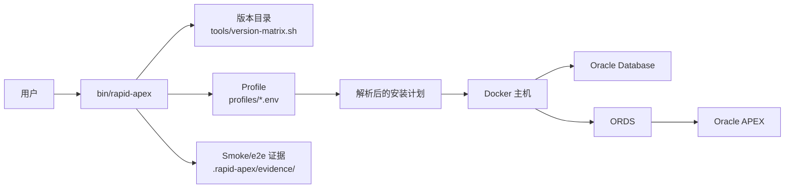
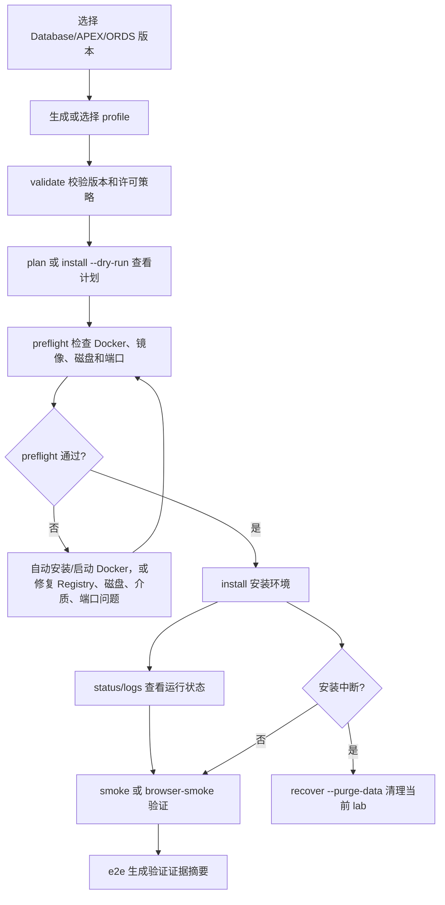

# Rapid-APEX ([English](https://github.com/wfg2513148/rapid-apex) [中文](https://github.com/wfg2513148/rapid-apex/blob/master/CN.md))


> [Oracle APEX](https://apex.oracle.com/zh-cn/) 的安装过程比较繁琐，涉及 Oracle Database、APEX、ORDS、Docker 镜像、端口和安装介质等多项配置。Rapid-APEX 现在通过仓库内的 `bin/rapid-apex` CLI 和可复用 profile 来创建可重复的 APEX 测试环境。

# 一键安装部署

最快的工作链路是直接运行 CLI 的 `e2e` 命令。它会完成安装部署、状态检查、HTTP smoke、浏览器验证，并输出验证证据：

```bash
mkdir -p rapid-apex-bootstrap
cd rapid-apex-bootstrap
curl -fsSL https://codeload.github.com/wfg2513148/rapid-apex/tar.gz/refs/heads/master | tar -xz --strip-components=1
bin/rapid-apex e2e --profile profiles/26ai-apex261-ords26.env
```

如果已经下载了仓库，只需要执行：

```bash
bin/rapid-apex e2e --profile profiles/26ai-apex261-ords26.env
```

这个 profile 会部署 Oracle Database 26ai Free、Oracle APEX 26.1 和 ORDS 26.x。`e2e` 会在需要时自动尝试安装或启动 Docker，然后执行安装、状态检查、HTTP smoke、浏览器验证，并把验证证据写入 `.rapid-apex/evidence/<lab-name>/`。

只有需要在验证后停止环境时才加 `--destroy-after`；如果还要删除生成的数据目录，再加 `--purge-data`。

> 当前版本目录支持的产品版本:
> - **Oracle Database:** XE 18c, 19c Enterprise, 26ai Free, 26ai Enterprise
> - **Oracle APEX:** 26.1, 24.2, 24.1, 23.2, 23.1, 22.2, 22.1, 21.2, 21.1, 20.2, 20.1, 19.2, 19.1, 18.2, 18.1, 5.1.4, 5.0.4
> - **Oracle ORDS:** 26.x, 25.x, 24.x, 23.x, 22.x, 21.x, 20.x, 19.2, 18.4, 18.2, 18.1, 3.0.12
>
> 当前真实执行链路支持 legacy 18c XE + ORDS 3/18/19/20/21 组合，以及现代 Database + ORDS 官方镜像 profiles。

# 常用 CLI 命令

CLI 是一站式 APEX demo/test 环境的统一入口。目前已支持版本查看、profile 生成与校验、安装前检查、状态/日志/清理/恢复辅助命令、dry-run 安装计划和 e2e 验证摘要。

```bash
bin/rapid-apex list-versions
bin/rapid-apex validate --db 26ai --apex 26.1 --ords 26
bin/rapid-apex plan --db 26ai --apex 26.1 --ords 26 --name apex261-lab
bin/rapid-apex generate-profile --db 26ai --apex 26.1 --ords 26 --output profiles/custom-26ai.env
bin/rapid-apex preflight --profile profiles/26ai-apex261-ords26.env
bin/rapid-apex install --profile profiles/26ai-apex261-ords26.env
bin/rapid-apex status --profile profiles/26ai-apex261-ords26.env
bin/rapid-apex logs --profile profiles/26ai-apex261-ords26.env
bin/rapid-apex smoke --profile profiles/26ai-apex261-ords26.env
bin/rapid-apex browser-smoke --profile profiles/26ai-apex261-ords26.env
bin/rapid-apex e2e --profile profiles/26ai-apex261-ords26.env
bin/rapid-apex destroy --profile profiles/26ai-apex261-ords26.env
bin/rapid-apex recover --profile profiles/26ai-apex261-ords26.env
```

# 工作链路图示





默认数据库安装策略是 `demo`，只允许 Oracle XE 或 Free 版本。Enterprise Edition 场景统一视为 BYOL 目标，需要显式确认用户已具备有效 Oracle license/terms：

```bash
bin/rapid-apex plan --db 19c --apex 24.2 --ords 25 --license-policy byol
bin/rapid-apex plan --db 26ai-ee --apex 26.1 --ords 26 --license-policy byol
```

`e2e` 是脚本化端到端链路：会依次执行 preflight、安装、容器状态检查、HTTP smoke 检查，以及真实浏览器验证。默认截图证据会写入 `.rapid-apex/evidence/<lab-name>/`，同时生成 `e2e-summary.json`，记录版本、镜像、端口、最终 URL、截图路径、运行状态和清理状态。

Rapid-APEX 会优先使用 Oracle Container Registry 上的 Oracle 官方 Database / ORDS 镜像。旧 Dockerfile 构建链路只作为没有官方镜像路径时的 fallback。
新版 ORDS 官方镜像计划默认使用固定的大版本 tag，不再漂移到 `latest`；如果需要指定 Oracle 已发布的具体补丁 tag，可以使用 `--ords-image-tag TAG` 覆盖。
企业版数据库镜像也可以通过 `--db-image IMAGE` 覆盖，适配 Oracle 针对特定大版本发布的授权镜像 tag。

当前真实执行链路支持 legacy 18c XE + ORDS 3/18/19/20/21 组合，以及现代 Database + ORDS 官方镜像 profiles。legacy 和官方镜像安装都会自动创建 `demo` workspace 和 `demo/demo` 开发者账号，用于真实浏览器验收。

已完成真实安装验证的 profile 范围包括：

| Database | APEX | ORDS | Profile |
| --- | --- | --- | --- |
| 18c XE | 5.1.4, 18.2, 19.1, 20.2, 21.2 | 3.0.12, 18.4, 19.2, 20.x, 21.x | `profiles/18c-*` |
| 26ai Free | 22.2, 23.2, 24.1, 26.1 | 22.x, 23.x, 24.x, 26.x | `profiles/26ai-*` |
| 19c Enterprise BYOL | 22.1, 23.1, 24.2 | 23.x, 24.x, 25.x | `profiles/19c-*` |
| 26ai Enterprise BYOL | 26.1 | 26.x | `profiles/26ai-ee-*` |


# 自定义 Profile

创建一个 demo-policy 的 26ai Free 测试环境：

```bash
bin/rapid-apex generate-profile \
  --db 26ai \
  --apex 26.1 \
  --ords 26 \
  --output profiles/my-26ai-lab.env

bin/rapid-apex validate --profile profiles/my-26ai-lab.env
bin/rapid-apex preflight --profile profiles/my-26ai-lab.env
bin/rapid-apex install --profile profiles/my-26ai-lab.env
bin/rapid-apex e2e --profile profiles/my-26ai-lab.env
```

创建 legacy 18c XE 测试环境：

```bash
bin/rapid-apex generate-profile \
  --db 18c \
  --apex 19.1 \
  --ords 19.2 \
  --output profiles/my-18c-lab.env
```

Enterprise Edition 兼容性 profile 需要用户自行具备并确认有效 Oracle license/terms：

```bash
bin/rapid-apex generate-profile \
  --db 19c \
  --apex 24.2 \
  --ords 25 \
  --license-policy byol \
  --output profiles/my-19c-lab.env

bin/rapid-apex generate-profile \
  --db 26ai-ee \
  --apex 26.1 \
  --ords 26 \
  --license-policy byol \
  --output profiles/my-26ai-ee-lab.env
```

如果安装中途失败，可以只清理当前 lab 对应的资源：

```bash
bin/rapid-apex recover --profile profiles/my-26ai-lab.env --purge-data
```

`recover` 只针对所选 lab name 对应的 `<name>_db`、`<name>_ords`、`<name>_network` 和生成的数据目录，不会主动清理无关容器。

# 主机前置条件

- 首屏安装示例使用 `curl` 和 `tar` 下载仓库归档；安装部署不要求用户预先安装 Git。
- 运行环境需要 Docker。CLI 执行过程中会在可行时自动通过 `apt-get`、`dnf`、`yum` 或 Homebrew 安装 Docker、`curl`、`unzip` 等必需工具，并尝试启动 Docker daemon；如果当前主机不支持自动处理，会在耗时安装开始前给出明确失败原因。
- 官方 Database/ORDS 镜像 profile 需要足够本地磁盘空间存放 Oracle 镜像、安装介质、生成的 lab 数据、Playwright 和证据文件。现代官方镜像 profile 的 preflight 会检查至少 10 GiB 可用空间。
- Enterprise Edition profile 需要用户自行具备有效 Oracle BYOL 权利，并完成 Oracle Container Registry 登录和镜像条款确认。
- 浏览器 e2e 验证需要 Node.js 和 npm，CLI 会在 `.rapid-apex/playwright/` 下安装并运行 Playwright Chromium。
- 安装前所选主机端口必须空闲。生成的 profile 会使用非默认端口以避开常见本地 Oracle listener，也可以通过 `--db-port`、`--em-port`、`--ords-port` 覆盖。
- Oracle 安装介质必须能从 Oracle 官方下载地址或配置的 `--media-base` 镜像地址访问。

# 故障排查

| 现象 | 检查点 | 下一步 |
| --- | --- | --- |
| 必需工具自动配置失败 | 当前主机没有支持的包管理器/服务启动器，或当前用户没有安装、启动 Docker 等必需工具的权限。 | 按主机环境安装或启动提示中的工具，然后重跑 `bin/rapid-apex preflight --profile <profile>`。 |
| Enterprise 镜像不可访问 | 缺少 Oracle Registry 登录或 BYOL 镜像条款确认。 | 执行 `docker login container-registry.oracle.com`，确认所需镜像条款后重跑 preflight。 |
| ORDS 镜像不可访问 | 当前固定 ORDS tag 可能不存在。 | 使用 Oracle 已发布的 tag 通过 `--ords-image-tag TAG` 覆盖后重跑 preflight。 |
| 安装介质下载失败 | 网络或配置的 media mirror 不可访问。 | 检查网络后重试，或使用 `--media-base URL` 指向可访问镜像；下载失败会自动重试。 |
| 端口 preflight 失败 | 其他进程或容器占用了所选端口。 | 查看 preflight 输出的占用来源，换端口或停止冲突 lab。 |
| 安装中途停止 | 可能残留容器、network 或生成的数据目录。 | 运行 `bin/rapid-apex recover --profile <profile> --purge-data`，只清理当前 lab。 |
| destroy/recover 失败 | 容器归属数据或 Docker 资源无法删除。 | 查看残留资源报告，停止剩余容器后重跑 recover，或用合适权限删除列出的数据路径。 |
| browser smoke 登录前失败 | ORDS 可能还没就绪、APEX 仍在安装，或 Playwright 缺失。 | 先看 `bin/rapid-apex logs --profile <profile>`，再重跑 `smoke`，最后重跑 `browser-smoke` 或 `e2e`。 |


# 当前安装工作链路

当前主流程在仓库本地完成：

1. 选择支持的 Database/APEX/ORDS 版本组合。
2. 生成或复用 `profiles/` 下的 profile 文件。
3. 校验 profile。
4. 执行 preflight，检查 Docker、镜像访问、磁盘空间和端口；如果主机支持，会自动尝试安装或启动 Docker。
5. 安装 lab。
6. 执行 smoke 或 e2e 验证。

## 创建 profile

创建当前推荐的 Oracle Database Free 测试环境：

```bash
bin/rapid-apex generate-profile \
  --db 26ai \
  --apex 26.1 \
  --ords 26 \
  --output profiles/my-26ai-lab.env
```

创建 legacy 18c XE 测试环境：

```bash
bin/rapid-apex generate-profile \
  --db 18c \
  --apex 19.1 \
  --ords 19.2 \
  --output profiles/my-18c-lab.env
```

Enterprise Edition profile 需要显式 BYOL 确认，并要求用户具备 Oracle Container Registry 访问权限：

```bash
bin/rapid-apex generate-profile \
  --db 19c \
  --apex 24.2 \
  --ords 25 \
  --license-policy byol \
  --output profiles/my-19c-lab.env
```

## 校验并查看安装计划

```bash
bin/rapid-apex validate --profile profiles/my-26ai-lab.env
bin/rapid-apex plan --profile profiles/my-26ai-lab.env
bin/rapid-apex install --dry-run --profile profiles/my-26ai-lab.env
```

`validate` 用于校验版本组合和 license policy。`plan` 和 `install --dry-run` 会展示解析后的 Database 镜像、ORDS 镜像或介质、端口、lab 名称和安装族，不会启动耗时安装。

## 执行安装前检查

```bash
bin/rapid-apex preflight --profile profiles/my-26ai-lab.env
```

preflight 会检查 Docker 可用性、镜像访问、官方镜像 profile 所需磁盘空间，以及主机端口占用。Docker 缺失或未启动时，CLI 会优先自动安装或启动；仍失败时应先修复对应问题，再开始安装。

## 安装 APEX 环境

```bash
bin/rapid-apex install --profile profiles/my-26ai-lab.env
```

安装耗时通常取决于 Oracle 镜像拉取、安装介质下载、主机 CPU、磁盘和网络速度，可能需要几十分钟到几个小时。

## 验证运行状态

优先使用 CLI 辅助命令验证环境，而不是人工解读旧安装脚本输出：

```bash
bin/rapid-apex status --profile profiles/my-26ai-lab.env
bin/rapid-apex logs --profile profiles/my-26ai-lab.env
bin/rapid-apex smoke --profile profiles/my-26ai-lab.env
bin/rapid-apex browser-smoke --profile profiles/my-26ai-lab.env
```

如果需要完整脚本化验收，运行：

```bash
bin/rapid-apex e2e --profile profiles/my-26ai-lab.env
```

`e2e` 会执行 preflight、安装、状态检查、HTTP smoke 验证和真实浏览器流程。验证证据会写入 `.rapid-apex/evidence/<lab-name>/e2e-summary.json`。

## 访问 APEX 和数据库

生成的 profile 中会包含 `RAPID_APEX_ORDS_PORT`、`RAPID_APEX_DB_PORT` 和 `RAPID_APEX_EM_PORT`。使用这些值拼接本地访问地址和连接串。

默认 APEX 入口为：

```text
http://localhost:<RAPID_APEX_ORDS_PORT>/ords/
```

当前支持的安装链路会创建 `demo` workspace 和 `demo/demo` 开发者账号，用于浏览器验证。数据库连接信息取决于所选 Database family 和 profile 端口，连接前请先查看生成的 profile 和 `bin/rapid-apex plan --profile <profile>` 输出。

## 恢复或删除 lab

如果安装中途失败，只恢复当前 lab 对应资源：

```bash
bin/rapid-apex recover --profile profiles/my-26ai-lab.env --purge-data
```

环境不再需要时：

```bash
bin/rapid-apex destroy --profile profiles/my-26ai-lab.env --purge-data
```

这两个命令都按所选 lab name 限定范围，不会主动清理无关 Docker 资源。

# 写在最后

> 现在，你有能力快速安装部署不同版本的APEX/ORDS环境了。如果你觉得还不错，记得在Github上给我打星哦! [https://github.com/wfg2513148/rapid-apex](https://github.com/wfg2513148/rapid-apex)
