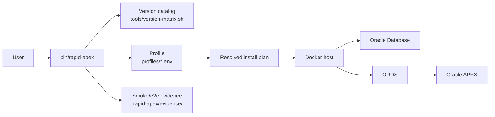
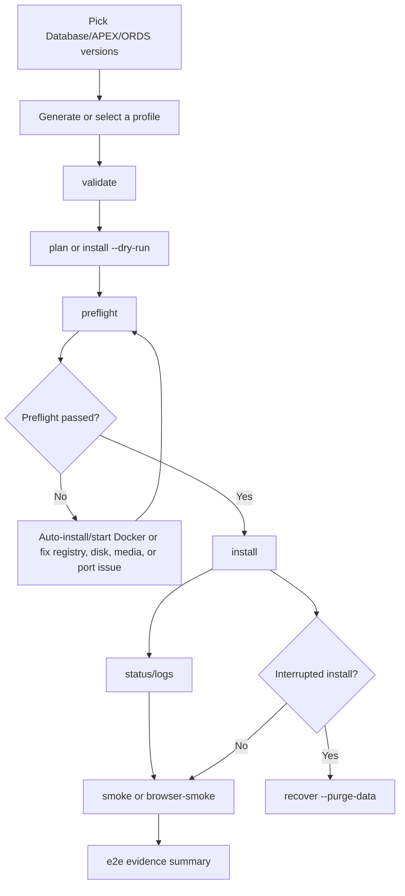

# Rapid-APEX

[English](https://github.com/wfg2513148/rapid-apex) | [中文](https://github.com/wfg2513148/rapid-apex/blob/master/CN.md)

Rapid-APEX is an MIT-licensed open-source toolkit for quickly provisioning reproducible Oracle Database, Oracle APEX, and ORDS environments with Docker.

It is designed for Oracle APEX developers, trainers, consultants, and maintainers who need disposable test environments across different APEX and ORDS versions for learning, demos, upgrade testing, troubleshooting, and extension development.

> Project status: Rapid-APEX is in v1.2.x stabilization. New environments are
> created through the `bin/rapid-apex` CLI and reusable profiles.

## Quick Start: One-Command Deployment

The fastest supported path is the CLI e2e command. It provisions the lab,
checks the result, and writes validation evidence:

```bash
mkdir -p rapid-apex-bootstrap
cd rapid-apex-bootstrap
curl -fsSL https://codeload.github.com/wfg2513148/rapid-apex/tar.gz/refs/heads/master | tar -xz --strip-components=1
bin/rapid-apex e2e --profile profiles/26ai-apex261-ords26.env
```

If you already downloaded the repository, run only:

```bash
bin/rapid-apex e2e --profile profiles/26ai-apex261-ords26.env
```

This profile installs an Oracle Database 26ai Free, Oracle APEX 26.1, and ORDS
26.x lab. The `e2e` command runs preflight checks, automatically tries to
install or start Docker when needed, installs the lab, checks container status,
runs HTTP smoke validation and browser validation, and writes an evidence
summary under `.rapid-apex/evidence/<lab-name>/`.

When the command finishes, use the `APEX access` block printed by `info`,
`status`, or `e2e`. For the bundled `profiles/26ai-apex261-ords26.env`
profile, the default APEX Builder entry point is:

```text
http://localhost:32514/ords/
```

Log in with workspace `demo`, username `demo`, and password `demo`.

If the lab containers are already running, rerunning `e2e` reuses them for
validation instead of reinstalling. To inspect the current environment without
Docker status checks or browser validation, use:

```bash
bin/rapid-apex info --profile profiles/26ai-apex261-ords26.env
```

Add `--destroy-after` only when the lab should be stopped after validation. Add
`--purge-data` when the generated lab data directory should also be removed.

## Why Rapid-APEX exists

Setting up Oracle Database, Oracle APEX, and ORDS manually can be time-consuming and error-prone, especially when developers need to compare versions, reproduce issues, or prepare temporary training environments.

Rapid-APEX provides a reproducible Docker-based workflow so developers can focus on building and validating APEX applications instead of repeatedly assembling infrastructure by hand.

## Supported Product List

Current version catalog supports:

- **Oracle Database:** XE 18c, 19c Enterprise, 26ai Free, 26ai Enterprise
- **Oracle APEX:** 26.1, 24.2, 24.1, 23.2, 23.1, 22.2, 22.1, 21.2, 21.1, 20.2, 20.1, 19.2, 19.1, 18.2, 18.1, 5.1.4, 5.0.4
- **Oracle ORDS:** 26.x, 25.x, 24.x, 23.x, 22.x, 21.x

The legacy XE 18c flow is still supported, and modern Database/ORDS profiles use
explicit official-image installer paths. See
[`docs/version-support.md`](docs/version-support.md).

## Maintainer Roadmap

Rapid-APEX is being refreshed to better serve the Oracle APEX developer community.

Planned improvements:

- Add support for recent Oracle APEX, ORDS, and Oracle Database versions
- Modernize Docker build scripts and runtime configuration
- Add GitHub Actions validation for shell scripts and Dockerfiles
- Improve installation documentation and troubleshooting guides
- Provide reproducible examples for APEX training, demos, and extension development
- Review legacy scripts for security, portability, and maintainability
- Create a clearer contribution path for other Oracle APEX developers

## Common CLI Tasks

The CLI is the stable front door for one-stop APEX lab creation. It supports
version discovery, profile generation and validation, preflight checks,
environment status/log helpers, cleanup/recovery, dry-run installation plans,
and scripted e2e evidence summaries.

```bash
bin/rapid-apex list-versions
bin/rapid-apex validate --db 26ai --apex 26.1 --ords 26
bin/rapid-apex plan --db 26ai --apex 26.1 --ords 26 --name apex261-lab
bin/rapid-apex generate-profile --db 26ai --apex 26.1 --ords 26 --output profiles/custom-26ai.env
bin/rapid-apex info --profile profiles/26ai-apex261-ords26.env
bin/rapid-apex preflight --profile profiles/26ai-apex261-ords26.env
bin/rapid-apex install --profile profiles/26ai-apex261-ords26.env
bin/rapid-apex status --profile profiles/26ai-apex261-ords26.env
bin/rapid-apex logs --profile profiles/26ai-apex261-ords26.env
bin/rapid-apex smoke --profile profiles/26ai-apex261-ords26.env
bin/rapid-apex browser-smoke --profile profiles/26ai-apex261-ords26.env
bin/rapid-apex e2e --profile profiles/26ai-apex261-ords26.env
bin/rapid-apex destroy --profile profiles/26ai-apex261-ords26.env
bin/rapid-apex recover --profile profiles/26ai-apex261-ords26.env
```

### Workflow At A Glance





Database installs use the `demo` license policy by default, which allows Oracle
XE and Free editions. Enterprise Edition profiles are BYOL targets and require
explicit acknowledgement because the user must have valid Oracle license/terms:

```bash
bin/rapid-apex plan --db 19c --apex 24.2 --ords 25 --license-policy byol
bin/rapid-apex plan --db 26ai-ee --apex 26.1 --ords 26 --license-policy byol
```

`e2e` is the scripted end-to-end path. Browser evidence is written under
`.rapid-apex/evidence/<lab-name>/` by default, including an `e2e-summary.json`
file with versions, images, ports, final URL, screenshot paths, status, and
cleanup status.

Rapid-APEX prefers Oracle official container images from Oracle Container
Registry for Database and ORDS. The legacy Dockerfile build path remains as a
fallback for older combinations that do not have an official image path.
ORDS official-image plans use pinned major-version tags instead of `latest`;
use `--ords-image-tag TAG` when a lab needs a specific Oracle-published patch
tag for that ORDS major.
Enterprise Database image plans can also be overridden with `--db-image IMAGE`
when Oracle publishes a different authorized tag for the selected major version.

Full execution is currently enabled for the legacy 18c XE + ORDS 21
family and for modern official Database + ORDS image profiles. Legacy and
official-image installs create a `demo` workspace and `demo` developer account
with password `demo` for browser-based validation.

Validated real-install profiles include:

| Database | APEX | ORDS | Profile |
| --- | --- | --- | --- |
| 18c XE | 21.2 | 21.x | `profiles/18c-*` |
| 26ai Free | 22.2, 23.2, 24.1, 26.1 | 22.x, 23.x, 24.x, 26.x | `profiles/26ai-*` |
| 19c Enterprise BYOL | 22.1, 23.1, 24.2 | 23.x, 24.x, 25.x | `profiles/19c-*` |
| 26ai Enterprise BYOL | 26.1 | 26.x | `profiles/26ai-ee-*` |

## Custom Profiles

For a demo-policy Oracle Database Free lab:

```bash
bin/rapid-apex generate-profile \
  --db 26ai \
  --apex 26.1 \
  --ords 26 \
  --output profiles/my-26ai-lab.env

bin/rapid-apex validate --profile profiles/my-26ai-lab.env
bin/rapid-apex preflight --profile profiles/my-26ai-lab.env
bin/rapid-apex install --profile profiles/my-26ai-lab.env
bin/rapid-apex e2e --profile profiles/my-26ai-lab.env
```

For a legacy 18c XE lab:

```bash
bin/rapid-apex generate-profile \
  --db 18c \
  --apex 19.1 \
  --ords 21 \
  --output profiles/my-18c-lab.env
```

For Enterprise Edition compatibility profiles, use BYOL only when you have
accepted the applicable Oracle license and registry terms:

```bash
bin/rapid-apex generate-profile \
  --db 19c \
  --apex 24.2 \
  --ords 25 \
  --license-policy byol \
  --output profiles/my-19c-lab.env

bin/rapid-apex generate-profile \
  --db 26ai-ee \
  --apex 26.1 \
  --ords 26 \
  --license-policy byol \
  --output profiles/my-26ai-ee-lab.env
```

If an installation fails partway through, clean only the selected lab resources:

```bash
bin/rapid-apex recover --profile profiles/my-26ai-lab.env --purge-data
```

`recover` is scoped to the selected lab name. It removes the matching
`<name>_db`, `<name>_ords`, and `<name>_network` resources and, with
`--purge-data`, generated lab data paths.

## Host Prerequisites

- The bootstrap example uses `curl` and `tar` to download the repository
  archive; Git is not required for installation.
- Docker is required at runtime. During CLI execution, Rapid-APEX automatically
  attempts to install required tools such as Docker, `curl`, and `unzip` with
  `apt-get`, `dnf`, `yum`, or Homebrew when they are available. It also attempts
  to start the Docker daemon through common Linux service managers, Colima, or
  Docker Desktop on macOS. If automatic setup is not possible, the CLI reports
  the unsupported step before any long-running install work.
- Official Database/ORDS profiles need enough local disk for Oracle images,
  installation media, generated lab data, Playwright, and evidence files. The
  CLI preflight checks for at least 10 GiB free for modern official-image
  profiles.
- Enterprise Edition profiles require valid Oracle BYOL rights plus Oracle
  Container Registry login and accepted image terms.
- Browser e2e validation requires Node.js and npm so the CLI can install and
  run Playwright Chromium under `.rapid-apex/playwright/`.
- Selected host ports must be free before install. Generated profiles use
  non-default ports to avoid common local Oracle listeners, but callers can
  override them with `--db-port`, `--em-port`, and `--ords-port`.
- Oracle installation media must be reachable from Oracle's public download
  host. Rapid-APEX does not default to third-party mirrors for Oracle media.

## Troubleshooting

| Symptom | What to check | Next action |
| --- | --- | --- |
| Automatic tool setup cannot be completed | The host does not expose a supported package manager/service starter, or the current user cannot install/start required tools such as Docker. | Install or start the reported tool with host-appropriate privileges, then rerun `bin/rapid-apex preflight --profile <profile>`. |
| Enterprise image is not reachable | Oracle Registry login or BYOL terms acceptance is missing. | Open `https://container-registry.oracle.com/ords/ocr/ba/database/enterprise`, sign in and accept the terms, then run `docker login container-registry.oracle.com` and `docker pull <image shown by preflight>`. Rerun the printed preflight command. |
| ORDS image is not reachable | The pinned ORDS tag may not exist in the registry for that major version. | Use `--ords-image-tag TAG` with an Oracle-published tag and rerun preflight. |
| Media download fails | Network access to Oracle official download hosts is unavailable. | Retry after checking connectivity to `download.oracle.com`. Downloads retry automatically before failing. |
| Port preflight fails | Another process or container owns the selected port. Ports owned by the current Rapid-APEX lab are accepted and reported as already bound by the current lab container. | Read the owner shown by preflight. If it is another process or a different lab, choose different ports or stop the conflicting lab. |
| Install stops partway through | Containers, network, or generated data may remain. | Run `bin/rapid-apex recover --profile <profile> --purge-data` to clean only the selected lab. |
| Destroy/recover fails | Container-owned data or a Docker resource could not be removed. | Review the residual resource report, stop remaining containers, then rerun recover or remove the listed data path with appropriate permissions. |
| Browser smoke fails before login | ORDS may not be ready, APEX may still be installing, or Playwright is missing. | Check `bin/rapid-apex logs --profile <profile>`, rerun `smoke`, then rerun `browser-smoke` or `e2e`. |

## Current Installation Workflow

The current installation workflow is repository-local:

1. Select a supported Database/APEX/ORDS combination.
2. Generate or reuse a profile file under `profiles/`.
3. Validate the profile.
4. Run preflight checks for Docker, image access, disk space, and ports. Docker
   setup is attempted automatically when the host supports it.
5. Install the lab.
6. Run smoke or e2e validation.

### Create a Profile

For a current Oracle Database Free lab:

```bash
bin/rapid-apex generate-profile \
  --db 26ai \
  --apex 26.1 \
  --ords 26 \
  --output profiles/my-26ai-lab.env
```

For a legacy XE 18c lab:

```bash
bin/rapid-apex generate-profile \
  --db 18c \
  --apex 19.1 \
  --ords 21 \
  --output profiles/my-18c-lab.env
```

Enterprise Edition profiles require BYOL acknowledgement and Oracle Container
Registry access:

```bash
bin/rapid-apex generate-profile \
  --db 19c \
  --apex 24.2 \
  --ords 25 \
  --license-policy byol \
  --output profiles/my-19c-lab.env
```

### Validate and Inspect the Plan

```bash
bin/rapid-apex validate --profile profiles/my-26ai-lab.env
bin/rapid-apex plan --profile profiles/my-26ai-lab.env
bin/rapid-apex install --dry-run --profile profiles/my-26ai-lab.env
```

`validate` checks the selected versions and license policy. `plan` and
`install --dry-run` show the resolved Database image, ORDS image or media,
ports, generated lab name, and installation family before any long-running work
starts.

### Run Preflight

```bash
bin/rapid-apex preflight --profile profiles/my-26ai-lab.env
```

Preflight checks Docker availability, selected image access, disk space for
official-image profiles, and host port availability. It automatically tries to
install or start Docker when the host supports it. Resolve any remaining
preflight failure before starting installation.

### Install the APEX Lab

```bash
bin/rapid-apex install --profile profiles/my-26ai-lab.env
```

Installation can take 30 minutes to several hours depending on Oracle image
pulls, installation media downloads, host CPU, disk, and network speed.

### Validate the Running Lab

Use the CLI helpers instead of manually interpreting generated shell output:

```bash
bin/rapid-apex status --profile profiles/my-26ai-lab.env
bin/rapid-apex logs --profile profiles/my-26ai-lab.env
bin/rapid-apex smoke --profile profiles/my-26ai-lab.env
bin/rapid-apex browser-smoke --profile profiles/my-26ai-lab.env
```

For a full scripted verification, run:

```bash
bin/rapid-apex e2e --profile profiles/my-26ai-lab.env
```

The `e2e` command runs preflight, install, status, HTTP smoke validation, and a
real browser flow. Evidence is written to
`.rapid-apex/evidence/<lab-name>/e2e-summary.json`.

### Access APEX and the Database

Generated profiles define `RAPID_APEX_ORDS_PORT`, `RAPID_APEX_DB_PORT`, and
`RAPID_APEX_EM_PORT`. Use those values to build local URLs and connection
strings.

The default APEX Builder entry point is:

```text
http://localhost:<RAPID_APEX_ORDS_PORT>/ords/
```

For `profiles/26ai-apex261-ords26.env`, that resolves to
`http://localhost:32514/ords/`. Supported install paths create a `demo`
workspace and `demo` developer account with password `demo` for browser
validation.

The `info` command prints the same access block without requiring Docker to be
reachable:

```bash
bin/rapid-apex info --profile profiles/26ai-apex261-ords26.env
```

Use `status` when you also want current container state.

Database connection details depend on the selected Database family and profile
ports; inspect the generated profile and
`bin/rapid-apex plan --profile <profile>` output before connecting.

### Recover or Remove a Lab

If installation stops partway through, recover only the selected lab resources:

```bash
bin/rapid-apex recover --profile profiles/my-26ai-lab.env --purge-data
```

When a lab is no longer needed:

```bash
bin/rapid-apex destroy --profile profiles/my-26ai-lab.env --purge-data
```

Both commands are scoped to the selected lab name and do not intentionally clean
unrelated Docker resources.

## Contributing

Contributions are welcome, especially around newer Oracle APEX/ORDS support, Docker modernization, documentation, and validation workflows.

Please see [CONTRIBUTING.md](CONTRIBUTING.md) for details.

## License

Rapid-APEX is released under the [MIT License](LICENSE).

## Maintainer

Rapid-APEX is maintained by [Kenny Wang](https://github.com/wfg2513148), who also publishes Oracle APEX technical content for the Chinese-speaking developer community.

If this project helps you, please consider starring the repository: <https://github.com/wfg2513148/rapid-apex>
